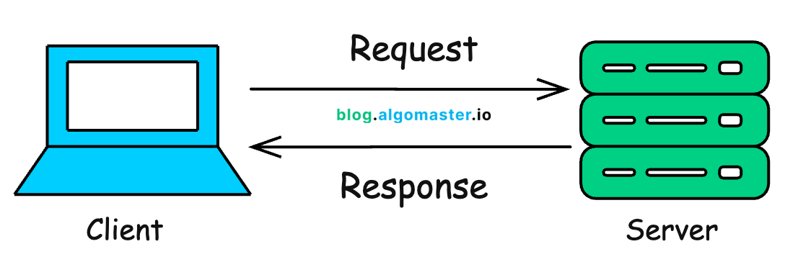
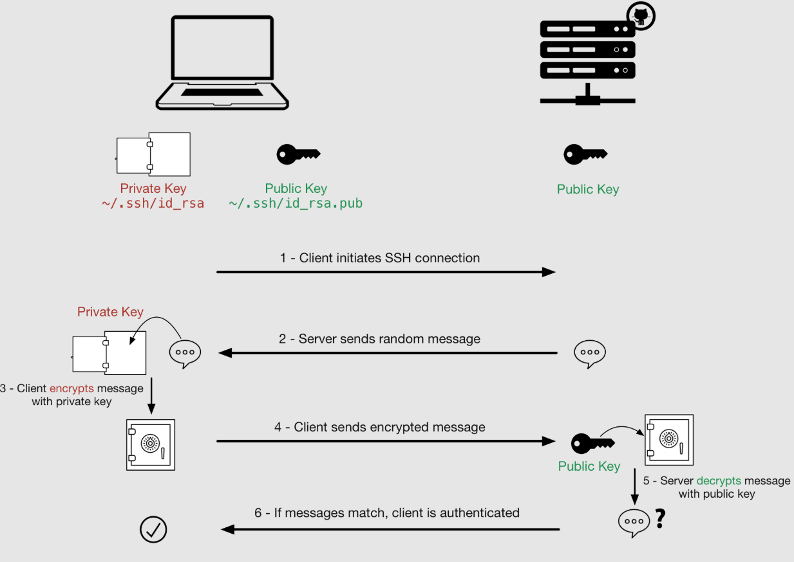

# Cloud & Linux Basics – Class Notes

## Table of Contents

1. [Computer Elements](#1-what-is-a-computer)
2. [Windows vs Linux](#2-operating-systems)
3. [Client Server Architecture](#4-client-server-architecture)
4. [Authentication Mechanisms](#5-authentication-mechanisms)
5. [Public Key and Private Key](#6-public-key--private-key-authentication)
6. [Firewall Creation](#8-firewall-basics)
7. [Launching EC2](#13-ec2-elastic-compute-cloud)
8. [Connect to EC2](#14-connecting-to-ec2-instance)

---

# 1. What is a Computer?

A **computer** is an electronic device that processes data and performs tasks based on instructions.

Examples of computing devices:

* Mobile Phone
* Laptop
* Desktop
* Server
* Smart TV
* Washing Machine
* Air Conditioner

All modern devices are becoming:

* **IP Enabled Devices**
* Connected to networks/internet
* Controlled using software

### Main Components of a Computer

| Component             | Purpose                                      |
| --------------------- | -------------------------------------------- |
| CPU / Processor       | Brain of the computer                        |
| RAM                   | Temporary memory used while running programs |
| ROM                   | Permanent memory                             |
| Storage               | Stores files and operating system            |
| Operating System (OS) | Interface between hardware and user          |

---

# 2. Operating Systems

Common Operating Systems:

* Windows
* Linux
* macOS (Mac)

## Windows vs Linux

| Windows               | Linux                             |
| --------------------- | --------------------------------- |
| GUI heavy             | Mostly command-line based         |
| Higher resource usage | Low RAM and low power usage       |
| Paid license          | Free and Open Source              |
| Requires antivirus    | Generally more secure             |
| Frequent restarts     | Can run for years without restart |
| Easier for beginners  | Preferred for servers/cloud       |
| Case insensitive      | Case sensitive                    |

### Case Sensitivity Example

#### Windows

```txt id="71f6zh"
Hello == hello
```

#### Linux

```txt id="jw2odj"
Hello != hello
```

---

# 3. Why Linux is Preferred for Servers

Linux servers are widely used because they are:

* Secure
* Fast
* Lightweight
* Stable
* Low bandwidth usage
* Low power consumption
* Efficient for heavy workloads
* Open source

### SSH-Based Access

Linux servers are usually accessed remotely using:

* SSH (Secure Shell)
* No graphics required
* Terminal/CLI based access

---

# 4. Client-Server Architecture

## Basic Concept

A **client** requests services.

A **server** provides services.

### Examples

| Client     | Server         |
| ---------- | -------------- |
| Browser    | Web Server     |
| Mobile App | Backend Server |
| SSH Client | Linux Server   |

### Real Example

When you open a website:

1. Browser sends request
2. Server processes request
3. Server sends response back



---

# 5. Authentication Mechanisms

Authentication means verifying identity.

## Types of Authentication

### 1. What You Know

Something you remember:

* Passwords
* PINs

### 2. What You Have

Something you possess:

* OTP
* RSA Tokens
* Authenticator Apps

### 3. What You Are

Biometric authentication:

* Fingerprint
* Retina scan
* Palm scan
* Face recognition

---

# 6. Public Key & Private Key Authentication

Used mainly for:

* SSH access
* Secure communication

## Important Concepts

### Public Key

* Shared with servers
* Can be safely distributed

### Private Key

* Secret
* Must never be shared

---

# 7. SSH Keys

SSH keys are generated using:

```bash id="u25m9w"
ssh-keygen -f daws-88s
```

This creates:

* Private Key → `daws-88s`
* Public Key → `daws-88s.pub`

## Usage

Server stores:

* Public key

User keeps:

* Private key



---

# 8. Firewall Basics

Firewall controls network traffic.

## Two Types of Traffic

### Inbound Traffic

Incoming traffic to server.

Rule:

> Do not trust anyone by default.

### Outbound Traffic

Traffic leaving the server.

Usually:

> Allow everything outbound.

### High Security Organizations

Organizations like:

* NASA
* DRDO

also monitor outbound traffic strictly.

---

# 9. Networking Basics

## IP Address

Example:

```txt id="t3r66w"
192.168.1.1
```

Every device connected to a network has an IP address.

---

## CIDR Block

```txt id="ngp00h"
0.0.0.0/0
```

Meaning:

> Allow access from every IP on the internet.

---

# 10. Protocols

A **protocol** is a set of rules for communication.

## Common Protocols

| Protocol | Port | Purpose                |
| -------- | ---- | ---------------------- |
| HTTP     | 80   | Website traffic        |
| HTTPS    | 443  | Secure website traffic |
| SSH      | 22   | Secure remote login    |

---

# 11. AWS Basics

## AWS Account Creation Requirements

* Credit/Debit card
* International transactions enabled
* PAN card mandatory
* Bank address should match AWS address
* Use correct first and last name

### Important Note

AWS Free Tier:

* Approximately $100 + $100 credits for 6 months
* Roughly around ₹18,000 benefits

### Warning

AWS enables:

> Auto-pay by default

Recommended:

* Disable auto-pay in UPI/cards if needed
* Monitor billing regularly

---

# 12. AWS Regions & Availability Zones

## Region

Physical geographic location.

Example:

```txt id="pp14ib"
us-east-1 → North Virginia
```

## Availability Zones (AZ)

Each region contains multiple AZs.

Example:

* East
* West
* North
* South

Purpose:

* High availability
* Fault tolerance

---

# 13. EC2 (Elastic Compute Cloud)

EC2 is a virtual server in AWS.

Also called:

* Instance
* Server
* Node

Used for:

* Hosting applications
* Running Linux servers
* Cloud computing

---

# 14. Connecting to EC2 Instance

## SSH Command

```bash id="b5ogjm"
ssh -i <private-key> username@IP
```

### Example

```bash id="e0e7q9"
ssh -i daws-88s ec2-user@54.80.53.154
```

---

## Breakdown of Command

| Part         | Meaning                    |
| ------------ | -------------------------- |
| ssh          | Secure Shell command       |
| -i           | Identity/private key       |
| daws-88s     | Private key file           |
| ec2-user     | Default AWS Linux username |
| 54.80.53.154 | Server public IP           |

---

# 15. Git Bash

Git Bash acts like:

* SSH client
* Mini Linux terminal on Windows

Useful for:

* SSH connections
* Linux commands

---

# 16. Windows vs Linux File Paths

## Windows Path

```txt id="56w7b0"
C:\Users\siva
```

Uses:

```txt id="gojq2g"
\
```

---

## Linux Path

```txt id="7w57yd"
/c/Users/siva
```

Uses:

```txt id="9ln64l"
/
```

---

# 17. Important Linux Commands

## Present Working Directory

```bash id="h48m7f"
pwd
```

Shows current directory.

---

## List Files

```bash id="8h1gzd"
ls -l
```

Displays detailed file listing.

---

# 18. Steps Practiced in Class

1. AWS account creation
2. Understanding client-server architecture
3. Creating SSH keys
4. Creating firewall/security group
5. Launching EC2 instance
6. Connecting to EC2 using SSH

---

# 19. Important Terminology

| Term           | Meaning                            |
| -------------- | ---------------------------------- |
| Server         | Powerful computer serving requests |
| Node           | Another name for server            |
| SSH            | Secure remote login protocol       |
| Firewall       | Controls network traffic           |
| Protocol       | Communication rules                |
| EC2            | AWS virtual machine                |
| Public IP      | Internet-accessible IP             |
| Authentication | Identity verification              |
