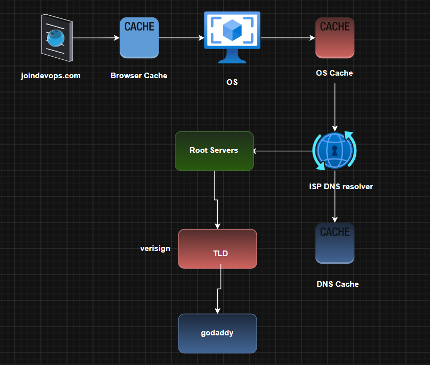

# 📘 Linux & DevOps Basics – Revision Notes

## 📌 Index

* [1. Vim Editor Basics](#1-vim-editor-basics)
* [2. User Management](#2-user-management)
* [3. SSH Key Authentication](#3-ssh-key-authentication)
* [4. Package Management](#4-package-management)
* [5. Service Management (systemctl)](#5-service-management-systemctl)
* [6. Network Management](#6-network-management)
* [7. File Permissions](#7-file-permissions)
* [8. Ownership Management](#8-ownership-management)
* [9. File Archiving (tar)](#9-file-archiving-tar)
* [10. Basic Linux Tools (awk, cut)](#10-basic-linux-tools-awk-cut)
* [11. Linux Distributions Overview](#11-linux-distributions-overview)

---

# 1. Vim Editor Basics

### 🚪 Exit & Save

* `:q` → quit
* `:q!` → force quit (discard changes)
* `:wq` → save and quit

### 🔍 Navigation & Search

* `:/text` → search from top
* `:?text` → search from bottom
* `:set nu` → show line numbers
* `:noh` → remove search highlight
* `:<line-number>` → go to line
* `:%d` → delete all lines
* `:%s/old/new/g` → replace text

### ⌨️ Esc Mode Commands

* `u` → undo
* `Ctrl + r` → redo
* `gg` → go to top
* `G` → go to bottom
* `yy` → copy line
* `p` → paste below
* `P` → paste above
* `dd` → cut line

---

# 2. User Management

### 👤 User Commands

* `useradd <username>` → create user
* `passwd <username>` → set password
* `userdel <username>` → delete user
* `id <username>` → show user ID info

### 📁 Important Files

* `/etc/passwd` → user accounts info
* `/etc/group` → group info

### 👥 Group Management

* `usermod -g group user` → change primary group
* `usermod -aG group user` → add to secondary group
* `gpasswd -d user group` → remove user from group

---

# 3. SSH Key Authentication

### 🔐 Login Setup Flow

1. Generate SSH keys
2. Share public key with admin
3. Admin creates `~/.ssh` directory
4. Permissions:

   * `.ssh` → `700`
   * `authorized_keys` → `600`
5. Paste public key into `authorized_keys`

### 🔑 SSH Login

```bash
ssh -i keyfile username@IP
```

### ⚙️ SSH Config

* `/etc/ssh/sshd_config`
* `sshd -t` → test SSH config

---

# 4. Package Management

### 📦 Package Managers

* `yum` → old RHEL systems
* `dnf` → modern RHEL systems
* `apt-get / apt` → Debian/Ubuntu systems

### 📥 Install Package

```bash
dnf install <package-name>
```

### 📁 Repo Location

* `/etc/yum.repos.d/` → repository configuration files

### 🧩 Jenkins Installation Example

```bash
sudo wget -O /etc/yum.repos.d/jenkins.repo \
https://pkg.jenkins.io/redhat-stable/jenkins.repo

sudo yum upgrade
sudo yum install fontconfig java-21-openjdk
sudo yum install jenkins
sudo systemctl daemon-reload
```

---

# 5. Service Management (systemctl)

### ⚙️ Service Commands

* `systemctl start <service>`
* `systemctl stop <service>`
* `systemctl restart <service>`
* `systemctl status <service>`
* `systemctl enable <service>` → auto-start on boot
* `systemctl disable <service>`

### 🌐 Example Services

* `sshd` → SSH service (port 22)
* `nginx` → web server (port 80)
* `wget`, `curl` → tools (not always services)

### 🧠 Concept

* Services run on ports (e.g., HTTPS → 443, SSH → 22)
* System maps domain → IP → port → service
* We have ports from 0 to 65,535

---

# 6. Network Management

### 🌐 Check port is running or not and accessible to internet or not

```bash
netstat -lntp
```

### 📌 What it shows:

* Listening ports
* TCP connections
* Process using port

### 🌐 To display detailed information about all the running process

```bash
ps -ef
```

### 🌐 To check domain details
```bash
dig www.example.com
nslookup www.example.com
```

### Example



---

# 7. File Permissions

### 🔐 Permission Types

* `r` → read = 4
* `w` → write = 2
* `x` → execute = 1

### 👥 Structure

```
User (u) | Group (g) | Others (o)
```

Example:

```
rw- r-- r--
```

### ⚙️ chmod Examples

```bash
chmod o+w file      # give others write permission
chmod 764 file      # rwx (7) rw (6) r (4)
```

---

# 8. Ownership Management

### 👑 Change Ownership

```bash
chown user:group file
```

### ⚠️ Rule

* Only **root** can change ownership
* Even file owner cannot change it

---

# 9. File Archiving (tar)

### 📦 Commands

```bash
tar -xf file.tar.gz   # extract
tar -cf file.tar.gz folder/  # create archive
```

---

# 10. Basic Linux Tools (awk, cut)

### 🔧 Used for:

* Text processing
* Column extraction
* Data filtering

---

# 11. Linux Distributions Overview

### 🐧 Families

* **RHEL Family**: RedHat, CentOS, Fedora, AWS Linux
* **Debian Family**: Ubuntu
* Other: Oracle Linux, SUSE, IBM Linux

### 📦 Types

* Community Edition → Free
* Enterprise Edition → Paid (with support)
