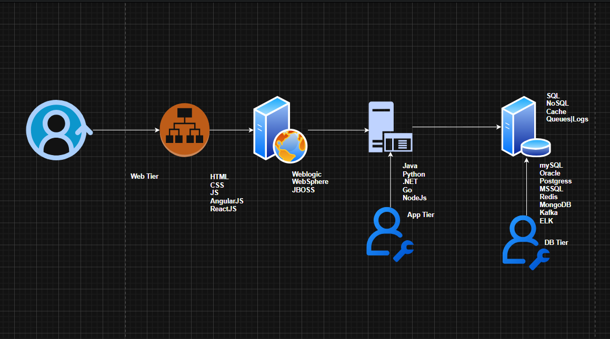

# 📘 Class Notes: Process Management & 3-Tier Architecture

## 📌 Index

* [1. Process Management Basics](#1-process-management-basics)
* [2. Parent–Child Process Concept](#2-parentchild-process-concept)
* [3. Linux Process & PID Concepts](#3-linux-process--pid-concepts)
* [4. Foreground vs Background Processes](#4-foreground-vs-background-processes)
* [5. Process Resource Usage & Monitoring](#5-process-resource-usage--monitoring)
* [6. Process Logs, Kill & Restart](#6-process-logs-kill--restart)
* [7. 3-Tier Architecture Overview](#7-3-tier-architecture-overview)
* [8. Real-World Analogy (Restaurant Model)](#8-real-world-analogy-restaurant-model)
* [9. Web Application Flow](#9-web-application-flow)
* [10. Problems in Old Architecture](#10-problems-in-old-architecture)
* [11. DevOps Practice Notes](#11-devops-practice-notes)

---

# 1. Process Management Basics

Process management is how an operating system handles running tasks.

* Every task in Linux is treated as a **process**
* Each process gets:

  * CPU time
  * Memory (RAM)
  * Storage resources

💡 Example analogy:

* DM assigns work → TL → SE → JE → Fresher completes task
  This is similar to how processes are created and handled in Linux.

---

# 2. Parent–Child Process Concept

* Every process has a **parent process**
* Parent creates a **child process**

### Example hierarchy:

* DM → Parent of TL
* TL → Parent of SE
* SE → Parent of JE
* JE → Parent of Fresher

💡 In Linux:

* Every process originates from a parent process
* Root ancestor is **init/systemd**

---

# 3. Linux Process & PID Concepts

### Key terms:

* **PID** → Process ID (unique identifier)
* **PPID** → Parent Process ID

### Root processes:

* PID `0` → Kernel (system process)
* PID `1` → `systemd` (first user-space process)

### Example:

| PID | PPID | Meaning               |
| --- | ---- | --------------------- |
| 2   | 0    | Kernel thread         |
| 3   | 2    | Child of kernel       |
| 4   | 2    | Another kernel thread |

---

### `ps` command

Used to view running processes:

```bash
ps
```

Example output:

```
UID   PID  PPID  CMD
root    1     0   systemd
root    2     0   kthreadd
```

---

# 4. Foreground vs Background Processes

### Foreground process:

* Runs in terminal
* Blocks screen until completion
* You cannot use terminal during execution

### Background process:

* Runs without blocking terminal
* You can continue other tasks

---

# 5. Process Resource Usage & Monitoring

Each process consumes:

* CPU
* RAM
* Disk I/O

### Why monitoring is important:

* Prevent system overload
* Identify slow or stuck processes

### Logs to check:

* Server logs
* Application logs
* Database logs
* Heap dumps

---

# 6. Process Logs, Kill & Restart

### Common operations:

* Check running process
* Identify issues
* Kill unwanted process
* Restart service

### Example actions:

```bash
kill <PID>
```

or restart service:

```bash
systemctl restart <service>
```

### CPU usage patterns:

* 5% → normal
* 10% → moderate
* 20% → high
* 80% → critical issue

---

# 7. 3-Tier Architecture Overview

3-tier architecture separates an application into 3 layers:

## 1. Presentation Layer (UI)

* Web browser / frontend
* HTML, CSS, JavaScript

## 2. Application Layer (Business logic)

* Processes user requests
* Validates data
* Handles logic

## 3. Database Layer

* Stores and retrieves data
* Example: SQL databases

## Example



---

# 8. Real-World Analogy (Restaurant Model)

### Restaurant structure:

* **Customer** → user
* **Captain/Waiter** → collects order (UI layer)
* **Chef** → prepares food (application layer)
* **Kitchen storage** → database

### Flow:

1. Customer places order
2. Waiter takes order
3. Chef prepares food
4. Waiter serves food
5. Customer eats

---

# 9. Web Application Flow

### Backend flow:

```
User → Web Server → Application Server → Database Server
```

### Data flow:

1. User sends request (login, search, etc.)
2. Application queries database:

```sql
SELECT * FROM users 
WHERE username="sivakumar" AND password="siva123";
```

3. Database returns:

* 1 → user found
* 0 → user not found

4. Web server formats response using HTML/CSS/JS

---

# 10. Problems in Old Architecture

### Issues with 1-tier / 2-tier systems:

* Maintenance is difficult
* No proper queue handling
* Security issues
* Data stored locally
* Cannot access remotely
* System crashes affect entire application
* Not scalable

---

# 11. DevOps Practice Notes

### Example environment:

* EC2 instance setup
* AMI used: `ami-09c813fb71547fc4f`
* OS: RHEL 9

### Credentials example:

* Username: `ec2-user`
* Password: `DevOps321`

### Key idea:

DevOps ensures:

* Automation
* Monitoring
* Deployment
* System reliability
